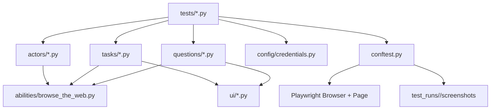

# MCDynect Automation

End-to-end UI test automation for MCDynect using Playwright and the Screenplay Pattern.

## Overview
This project models user roles as Actors who perform Tasks and ask Questions about the UI.
Selectors live in `ui/`, business actions in `tasks/`, and assertions in `questions/`.

## Latest Verification
- Last full run date: `2026-02-12`
- Command: `MCDYNECT_HEADLESS=true pytest -q`
- Result: `21 passed`

## Tech Stack
- Python
- Pytest
- Playwright (sync API)

## Full Architecture

### Core Pattern
- **Actors** represent user roles (`actors/`)
- **Abilities** provide technical capabilities (browser control) (`abilities/`)
- **Tasks** model user/business actions (`tasks/`)
- **Questions** read UI state for assertions (`questions/`)
- **UI Locators** are centralized selectors (`ui/`)
- **Tests** orchestrate scenario flows (`tests/`)
- **Pytest Fixtures/Hooks** manage browser lifecycle and screenshots (`conftest.py`)
- **Config** provides base URL + credentials from env (`config/credentials.py`)

### Runtime Flow
1. Pytest starts and creates run artifact directory: `test_runs/<timestamp>/`
2. Session browser is launched (`conftest.py`)
3. A test requests an actor fixture (example: `the_licensee`)
4. Actor is created and granted `BrowseTheWeb` ability with a fresh Playwright page
5. Test calls `actor.attempts_to(Task...)`
6. Task uses UI locators to perform actions (login, logout, update profile, etc.)
7. Test asserts with Questions and URL checks
8. Screenshot is captured after each test (pass/fail) under `test_runs/<timestamp>/screenshots/...`

### Layer Map


### Key Files
- `conftest.py`: Playwright browser/page fixtures, actor fixtures, screenshot hook
- `config/credentials.py`: loads `.env`, enforces required env vars
- `abilities/browse_the_web.py`: wrapper for Playwright page operations
- `tasks/login.py`: login flow + optional onboarding handling
- `tasks/login_as.py`: role-based login using configured credentials
- `tests/test_login_*.py`: split role login smoke/negative scenarios
- `tests/test_licensee_opening_day.py`: UC07 opening day basic + exception path
- `tests/test_licensee_announcements.py`: UC08 announcements listing/details
- `tests/test_licensee_staff_directory.py`: UC09 staff directory listing
- `tests/test_licensee_modify_staff.py`: UC10 modify staff information
- `TEST_MATRIX.md`: latest run result and test-to-use-case mapping
- `USE_CASES.md`: business use-case inventory

## Setup From Scratch

### Prerequisites
- Python 3.10+ recommended
- Git

### Commands
```bash
# 1) Clone
git clone <your-repo-url> mcdynect_automation
cd mcdynect_automation

# 2) Create and activate virtual environment
python3 -m venv .venv
source .venv/bin/activate

# 3) Install dependencies
pip install -U pip
pip install pytest "playwright>=1.40.0"

# 4) Install Playwright browser binaries
python -m playwright install

# 5) Create env file
cp .env.example .env

# 6) Fill .env with real role credentials and URLs

# 7) Run full suite (headless)
MCDYNECT_HEADLESS=true pytest -q
```

## Useful Test Commands
```bash
# Run all tests with browser UI visible
MCDYNECT_HEADLESS=false pytest -q

# Run only login scenarios
MCDYNECT_HEADLESS=true pytest -q tests/test_login_*.py

# Run one test function
MCDYNECT_HEADLESS=true pytest -q tests/test_login_licensee.py -k test_licensee_can_log_in

# Run only licensee-marked tests
MCDYNECT_HEADLESS=true pytest -q -m licensee

# Select browser engine
MCDYNECT_BROWSER=chromium MCDYNECT_HEADLESS=true pytest -q
MCDYNECT_BROWSER=firefox MCDYNECT_HEADLESS=true pytest -q
MCDYNECT_BROWSER=webkit MCDYNECT_HEADLESS=true pytest -q
```

## Configuration
Configuration is loaded by `config/credentials.py` (with `.env` auto-load) and can be overridden by environment variables.

Required keys:
- `MCDYNECT_BASE_URL`
- `MCDYNECT_HEADLESS`
- `MCDYNECT_BROWSER`
- `MCDYNECT_LICENSEE_EMAIL`
- `MCDYNECT_LICENSEE_PASSWORD`
- `MCDYNECT_LICENSEE_CURRENT_PASSWORD`
- `MCDYNECT_LICENSEE_NEW_PASSWORD`
- `MCDYNECT_LICENSEE_DASHBOARD_URL`
- `MCDYNECT_AREA_MANAGER_EMAIL`
- `MCDYNECT_AREA_MANAGER_PASSWORD`
- `MCDYNECT_AREA_MANAGER_DASHBOARD_URL`
- `MCDYNECT_INVENTORY_EMAIL`
- `MCDYNECT_INVENTORY_PASSWORD`
- `MCDYNECT_INVENTORY_DASHBOARD_URL`
- `MCDYNECT_PROCUREMENT_EMAIL`
- `MCDYNECT_PROCUREMENT_PASSWORD`
- `MCDYNECT_PROCUREMENT_DASHBOARD_URL`
- `MCDYNECT_PRODUCTION_EMAIL`
- `MCDYNECT_PRODUCTION_PASSWORD`
- `MCDYNECT_PRODUCTION_DASHBOARD_URL`
- `MCDYNECT_LICENSING_EMAIL`
- `MCDYNECT_LICENSING_PASSWORD`
- `MCDYNECT_LICENSING_DASHBOARD_URL`
- `MCDYNECT_COMPLIANCE_EMAIL`
- `MCDYNECT_COMPLIANCE_PASSWORD`
- `MCDYNECT_COMPLIANCE_DASHBOARD_URL`
- `MCDYNECT_FINANCE_EMAIL`
- `MCDYNECT_FINANCE_PASSWORD`
- `MCDYNECT_FINANCE_DASHBOARD_URL`

If any key is missing, startup fails fast with:
`RuntimeError: Missing required environment variable: <KEY>`

## Artifacts and Notes
- Screenshots are taken automatically after each test and saved under `test_runs/<timestamp>/screenshots`.
- `pytest.ini` excludes the legacy `Automation-Testing-MCDynect/` folder from discovery.
- `TEST_MATRIX.md` tracks the latest execution summary and coverage matrix.
- `USE_CASES.md` tracks automated business use cases.
